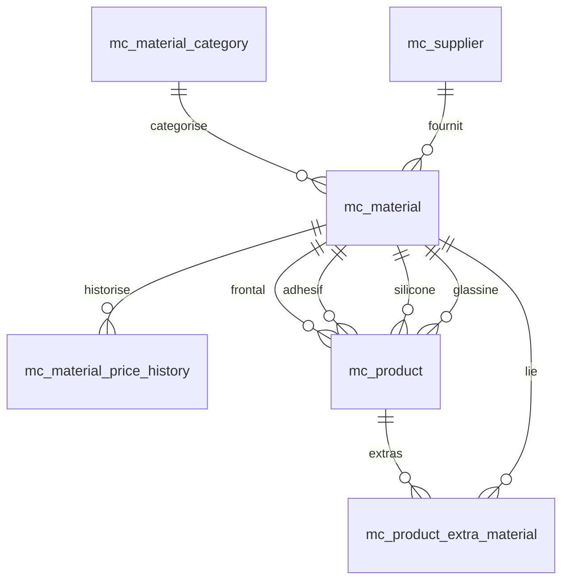

# Module Coûts matières (MySifa `/pricing`)

Outil de calcul des coûts matières premières et des fiches produits (€/m²), distinct de l’ancien module MyDevis (`matiere_*`).

---

## Schéma du domaine

### Tables principales (préfixe `mc_`)

| Table | Rôle |
|-------|------|
| `mc_setting` | Paramètres globaux (taux EUR/USD, conteneur, marge par défaut) |
| `mc_supplier` | Fournisseurs |
| `mc_material_category` | Catégories : FRONTAL, ADHESIF, SILICONE, GLASSINE, AUTRE |
| `mc_material` | Matières premières (prix, poids, import, etc.) |
| `mc_material_price_history` | Historique des changements de prix |
| `mc_product` | Produits finis (assemblage de matières) |
| `mc_product_extra_material` | Matières supplémentaires (hors 4 composants standards) |

### Relations (simplifié)



- Un **produit** référence jusqu’à 4 matières (frontal, adhésif, silicone, glassine) + éventuelles matières « extra ».
- Les **paramètres** (`mc_setting`) s’appliquent à toutes les matières (taux de change, coût conteneur par défaut, marge vente par défaut).

Référence SQL : `docs/schema_mc_material_cost_v78.sql` — migration appliquée dans `app/core/database.py` (v78+).

---

## Formule de calcul

Moteur pur : `app/services/pricing/engine.py` (aucun accès DB).

### Prix matière €/m²

Pour chaque matière, le prix est décomposé en :

`price_eur_per_m2 = raw + transport + fx + tax_uplift`

(arrondi à 4 décimales ; la somme des lignes = total.)

#### Cas A — Prix au **kg** (`price_basis = PER_KG`)

**EUR/kg, non importée**

- `raw = unit_price × weight_per_m2`
- `transport = 0`, `fx = 0`

**USD/kg, importée** (transport conteneur)

- `transport_usd_per_kg = container_cost_usd / container_kg` (défauts settings si non renseigné sur la matière)
- `raw = unit_price × weight_per_m2 × eur_usd_rate`
- `transport = transport_usd_per_kg × weight_per_m2 × eur_usd_rate`

#### Cas B — Prix au **m²** (`price_basis = PER_M2`)

**EUR/m²**

- `raw = unit_price`

**USD/m²**

- `fx = unit_price × eur_usd_rate` (ligne « change »)

#### Taxes

Si `tax_incidence > 1` :

- `tax_uplift = (raw + transport + fx) × (tax_incidence − 1)`

### Exemple chiffré — adhésif importé USD/kg

| Paramètre | Valeur |
|-----------|--------|
| `unit_price` | 3 USD/kg |
| `weight_per_m2` | 0,05 kg/m² |
| `eur_usd_rate` | 0,85 |
| `container_cost_usd` | 4 000 |
| `container_kg` | 26 000 |
| `tax_incidence` | 1 |

1. `transport_usd_per_kg = 4000 / 26000 ≈ 0,1538 USD/kg`
2. Coût USD/m² avant change : `(3 + 0,1538) × 0,05 ≈ 0,1577 USD/m²`
3. **Prix €/m²** : `0,1577 × 0,85 ≈ **0,1341 €/m²**`

### Prix produit €/m²

- `total_eur_per_m2` = somme des prix €/m² de chaque composant renseigné (silicone absent = ignoré).
- `margin_eur_m2` = marge custom du produit, sinon `default_margin_eur_m2` (settings).
- `sell_price_eur_m2` = `total + margin`
- Chaque composant reçoit un `share_pct` (% du coût matière total).

---

## Ajouter une nouvelle catégorie de matière

Les catégories sont contraintes en base (`CHECK` sur `mc_material_category.code`).

1. **Migration** numérotée dans `app/core/database.py` (`_migrate()`) :
   - Étendre le `CHECK` SQLite (recréation table si nécessaire) ou ajouter la valeur autorisée.
   - `INSERT OR IGNORE INTO mc_material_category (code, label, sort_order) VALUES ('NOUVEAU', 'Libellé', 6);`
2. **Backend** : ajouter le code dans `app/models/material_cost.py` (`MaterialCategoryCode`) et Pydantic si besoin.
3. **Moteur** : si la catégorie influence le calcul, adapter `engine.py` ; sinon elle sert surtout au filtrage UI.
4. **Frontend** : `static/pricing_app.js` — `CAT_CLASS`, couleurs breakdown, combobox produit.
5. **Seed Excel** : mapper `category_code` dans `scripts/seed_pricing.py` (`CATEGORY_CODE_MAP`).

Sans migration, toute insertion avec un code inconnu échouera côté SQLite.

---

## Seed depuis l’export Excel

Script : `scripts/seed_pricing.py`

Source JSON par défaut :

- `data/uploads/excel-data-export-fixed.json` si présent
- sinon `data/uploads/excel-data-export.json`

### Commandes

```bash
# Simulation (aucune écriture)
python scripts/seed_pricing.py --dry-run

# Import réel
python scripts/seed_pricing.py

# Fichier explicite
python scripts/seed_pricing.py --json data/uploads/excel-data-export.json
```

### Comportement

- **Idempotent** : upsert matières sur `(name, appellation_code)`, produits sur `(code)`.
- Transaction SQLite (`BEGIN` → `commit` ou `rollback` en dry-run).
- Insère / met à jour `mc_setting` (`eur_usd_rate`, `default_container_cost_usd`, etc.).
- Crée fournisseurs, matières (mapping catégories, `is_imported`, devises), produits (fuzzy match des composants).
- Récap final : fournisseurs, matières, produits, composants non mappés.

Relancer le seed après correction du JSON est sans risque : les enregistrements existants sont mis à jour, pas dupliqués.

---

## API et permissions

Préfixe : `/api/pricing`

| Opération | Rôles |
|-----------|--------|
| GET (lecture, preview, export PDF/Excel) | Tout utilisateur connecté |
| POST / PATCH / DELETE | `direction`, `administration`, `superadmin` (`ROLES_ADMIN`) |

Implémentation : `_require_read` / `_require_write` dans `app/routers/pricing.py`.

---

## UI

- Routes : `/pricing`, `/pricing/materials`, `/pricing/products`, `/pricing/settings`
- Assets : `static/pricing_app.js`, `static/pricing_app.css`
- Page shell : `app/web/pricing_page.py`

---

## Tests

| Fichier | Contenu |
|---------|---------|
| `tests/test_pricing_engine.py` | Moteur pur (unitaire) |
| `tests/test_pricing_api.py` | Intégration API (parcours E2E métier + permissions) |

```bash
python -m unittest discover -s tests -p "test_*.py" -v
```

Le projet n’utilise pas Playwright ; les scénarios E2E demandés sont couverts par `test_pricing_api.py` via `TestClient` FastAPI (même logique métier que le navigateur).
